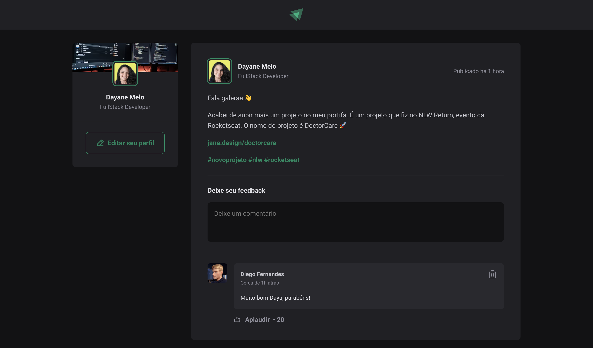

# Ignite Project

Projeto desenvolvido durante o curso Ignite da RocketSeat, focado em ensinar os fundamentos do ReactJS usando Vite como ambiente de desenvolvimento.



## Instalação

Para começar, clone o repositório para o seu ambiente local:

```bash
git clone https://github.com/daya-diaz/project-ignite.git

cd project-ignite

npm install
```
## Como Usar
Para iniciar o servidor de desenvolvimento, utilize o seguinte comando:
```bash
npm run dev
```
## Licença

Este projeto está licenciado sob a [Licença da RocketSeat](https://www.rocketseat.com.br/).

## Contato

Para perguntas ou sugestões, sinta-se à vontade para entrar em contato comigo em dayadiazprofissional@gmail.com ou siga-me no LinkedIn [Dayane Santos de Melo](https://www.linkedin.com/in/dayane-santos-melo/).

## Agradecimentos

Agradeço à RocketSeat por fornecer o curso Ignite, que inspirou e possibilitou a criação deste projeto.
